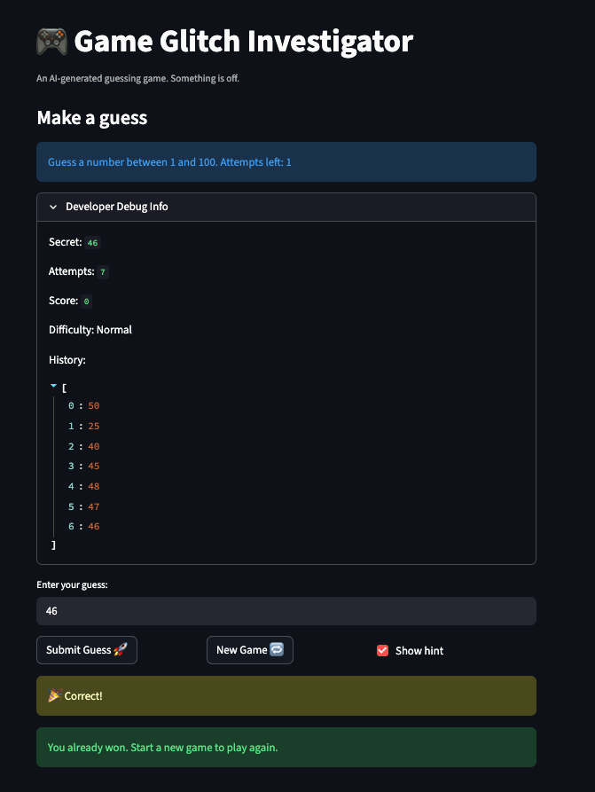
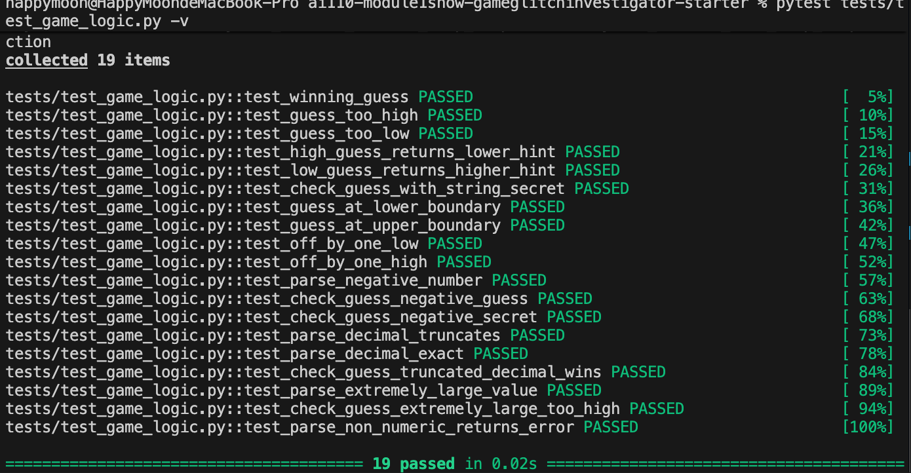

# 🎮 Game Glitch Investigator: The Impossible Guesser

## 🚨 The Situation

You asked an AI to build a simple "Number Guessing Game" using Streamlit.
It wrote the code, ran away, and now the game is unplayable. 

- You can't win.
- The hints lie to you.
- The secret number seems to have commitment issues.

## 🛠️ Setup

1. Install dependencies: `pip install -r requirements.txt`
2. Run the broken app: `python -m streamlit run app.py`

## 🕵️‍♂️ Your Mission

1. **Play the game.** Open the "Developer Debug Info" tab in the app to see the secret number. Try to win.
2. **Find the State Bug.** Why does the secret number change every time you click "Submit"? Ask ChatGPT: *"How do I keep a variable from resetting in Streamlit when I click a button?"*
3. **Fix the Logic.** The hints ("Higher/Lower") are wrong. Fix them.
4. **Refactor & Test.** - Move the logic into `logic_utils.py`.
   - Run `pytest` in your terminal.
   - Keep fixing until all tests pass!

## 📝 Document Your Experience

**Game Purpose:**
A number guessing game where the player tries to guess a secret number within a limited number of attempts. The game provides "Too High / Go LOWER!" or "Too Low / Go HIGHER!" hints after each guess, and difficulty levels control the number range and attempts allowed.

**Bugs Found:**
1. **Attempts counter wrong on start** — showed 7 attempts remaining before any guess was made, regardless of difficulty.
2. **New game didn't reset state** — old score, guess history, and secret number remained visible when starting a new game.
3. **Hints were inverted** — guessing below the secret said "Go LOWER!" and guessing above said "Go HIGHER!". Guessing 100 always returned "Go LOWER!".
4. **Attempts counter delayed update** — the counter didn't decrement until the next guess was submitted, causing "Attempts left: 1" to display when the game should have already ended.
5. **New Game button mid-game changed the secret** — pressing "New Game" while playing immediately reset the secret number.
6. **Difficulty slider had no effect on range** — the secret number always stayed between 1–100 regardless of difficulty chosen.
7. **String vs. integer comparison bug** — on even-numbered attempts, the secret was cast to a string, causing lexicographic comparison ("100" < "50") and incorrect hints.

**Fixes Applied:**
- Corrected the hint logic so `guess > secret` returns "Too High / Go LOWER!" and `guess < secret` returns "Too Low / Go HIGHER!".
- Removed the alternating `str(secret)` cast that caused string comparison on even attempts.
- Used Streamlit `session_state` to persist the secret number across reruns, preventing it from resetting on every button click.
- Fixed the difficulty range logic so the secret number is generated within the correct range for each difficulty level.
- Fixed the attempts counter to update immediately after each guess submission.
- Ensured "New Game" properly clears all previous game state before generating a new secret.

## 📸 Demo

- [ ] [Insert a screenshot of your fixed, winning game here]

## 🚀 Stretch Features

- [ ] [If you choose to complete Challenge 4, insert a screenshot of your Enhanced Game UI here]
