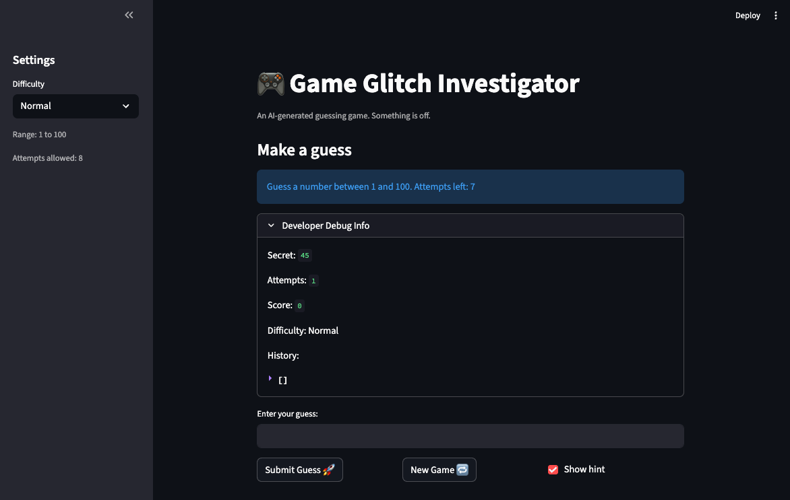
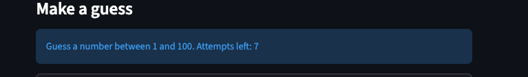
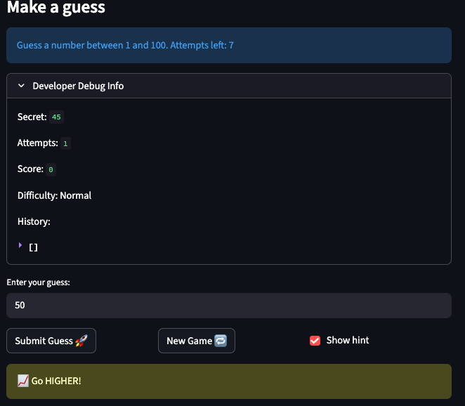
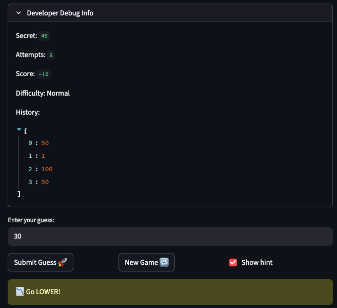
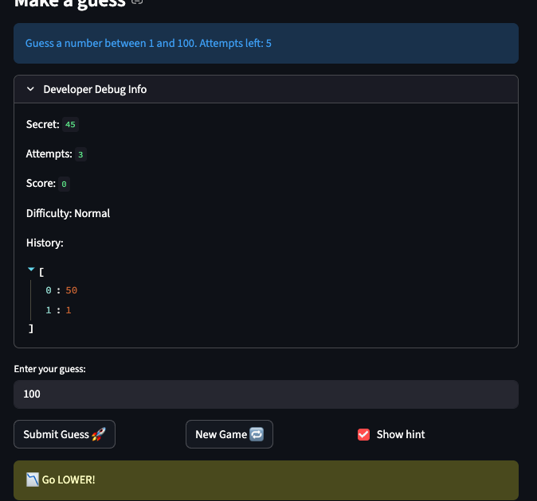
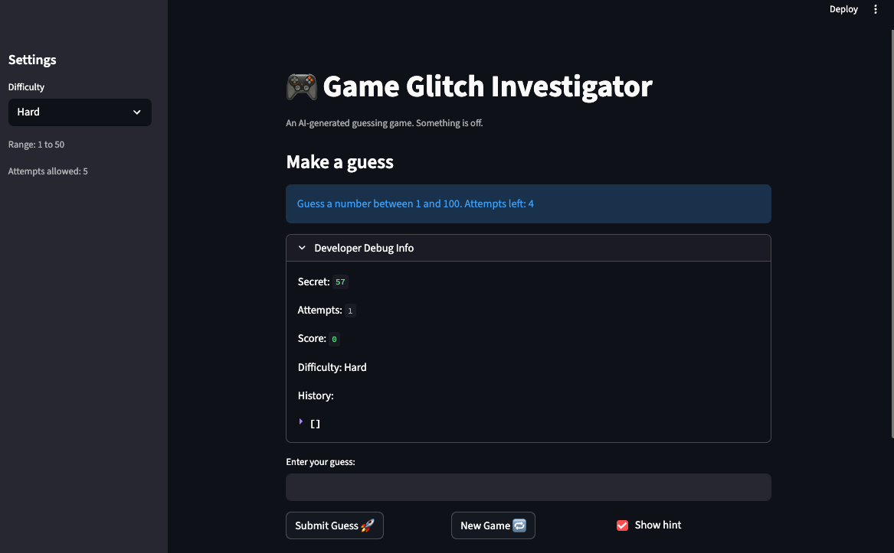

# 💭 Reflection: Game Glitch Investigator

Answer each question in 3 to 5 sentences. Be specific and honest about what actually happened while you worked. This is about your process, not trying to sound perfect.

## 1. What was broken when you started?

- What did the game look like the first time you ran it?
!
- List at least two concrete bugs you noticed at the start  
  (for example: "the secret number kept changing" or "the hints were backwards").

1. When I first loaded the game the "Attempts left" counter read 7 even before I’d guessed—this happened for every difficulty level.

2. Starting a new game didn’t clear out the previous game’s information; the old score, history, and secret remained visible.
3. The feedback hints were inverted: a guess below the secret prompted "go lower" and a guess above prompted "go higher". In particular, guessing 100 always produced "go lower".

4. After submitting a guess, the "Attempts left" counter didn't update immediately, requiring input of the next number to trigger the update. This caused issues like showing "Attempts left: 1" even when the game should have ended on the last attempt.
5. Pressing the "New Game" button in the middle of a game instantly changed the secret number.
6. Changing the difficulty slider didn’t alter the secret number’s range—the secret stayed between 1 and 100 no matter which difficulty I chose.

7. On even-numbered guesses, the secret number was converted to a string, which caused string comparison instead of numeric comparison. This made certain guesses (like 100) always return "go lower" due to lexicographic ordering (e.g., "100" < "50" as strings), even when numerically incorrect.
---

## 2. How did you use AI as a teammate?

- Which AI tools did you use on this project (for example: ChatGPT, Gemini, Copilot)?
- Give one example of an AI suggestion that was correct (including what the AI suggested and how you verified the result).
- Give one example of an AI suggestion that was incorrect or misleading (including what the AI suggested and how you verified the result).

---

## 3. Debugging and testing your fixes

- How did you decide whether a bug was really fixed?
- Describe at least one test you ran (manual or using pytest)  
  and what it showed you about your code.
- Did AI help you design or understand any tests? How?

---

## 4. What did you learn about Streamlit and state?

- In your own words, explain why the secret number kept changing in the original app.
- How would you explain Streamlit "reruns" and session state to a friend who has never used Streamlit?
- What change did you make that finally gave the game a stable secret number?

---

## 5. Looking ahead: your developer habits

- What is one habit or strategy from this project that you want to reuse in future labs or projects?
  - This could be a testing habit, a prompting strategy, or a way you used Git.
- What is one thing you would do differently next time you work with AI on a coding task?
- In one or two sentences, describe how this project changed the way you think about AI generated code.
